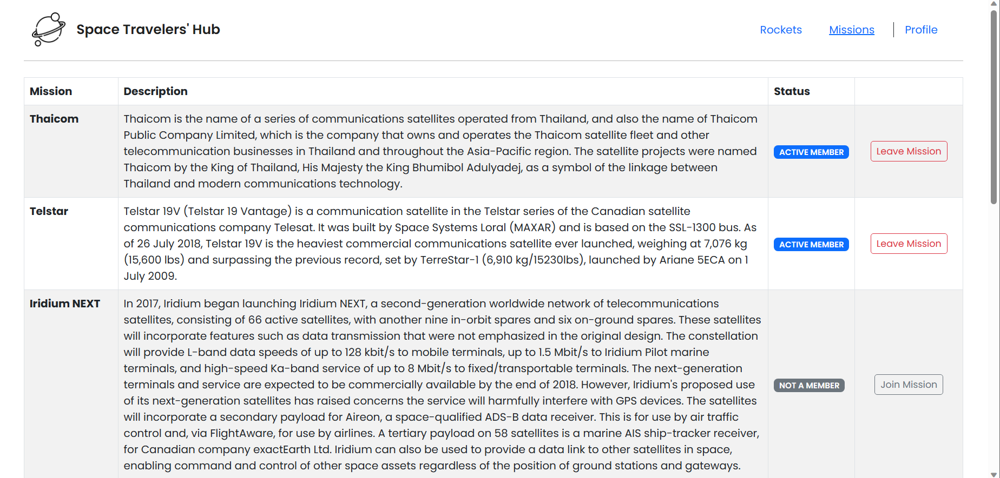
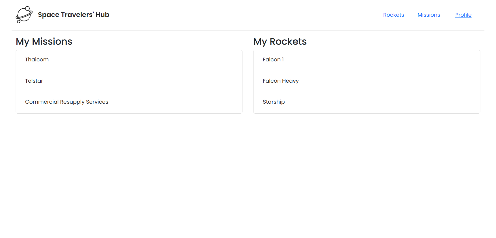

<a name="readme-top"></a>

<!-- TABLE OF CONTENTS -->

# 📗 Table of Contents

- [📖 About the Project](#about-project)
  - [🛠 Built With](#built-with)
    - [Tech Stack](#tech-stack)
    - [Key Features](#key-features)
  - [🖼️ScreenShot](#screenshot)
- [💻 Getting Started](#getting-started)
  - [Setup](#setup)
  - [Prerequisites](#prerequisites)
  - [Install](#install)
  - [Usage](#usage)
- [👥 Authors](#authors)
- [🔭 Future Features](#future-features)
- [🤝 Contributing](#contributing)
- [⭐️ Show your support](#support)
- [🙏 Acknowledgements](#acknowledgements)
- [📝 License](#license)

<!-- PROJECT DESCRIPTION -->

# 📖 [Space Traveler's Hub] <a name="about-project"></a>

Space Traveler's Hub is an application that provides commercial and scientific space travel services. The application allow users to book rockets and join selected space missions.

## 🛠 Built With <a name="built-with"></a>

### Tech Stack <a name="tech-stack"></a>

- **ReactJS**
- **Bootstrap CSS**
- **Redux-Toolkit**
- **CSS 3**

<!-- Features -->

### Key Features <a name="key-features"></a>

- **Navigation Bar**
- **Rockets List Page**
- **Missions List Page**
- **Profile Page**

<p align="right">(<a href="#readme-top">back to top</a>)</p>

## 🖼️ Screenshots <a name="screenshot"></a>






<p align="right">(<a href="#readme-top">back to top</a>)</p>

<!-- GETTING STARTED -->

## 💻 Getting Started <a name="getting-started"></a>

To get a local copy up and running, follow these steps.

### Prerequisites

In order to run this project you need to install Node:

```sh
 Node.js
```

### Setup

Clone this repository to your desired folder:

```sh
  git clone git@github.com/Matthieu96Code/spaceTravelersHub.git
  cd spaceTravelersHub
```

### Install

Install this project with:

Example command:

```sh
  npm install
```

-

### Usage

To run the project, execute the following command:

```sh
  npm run start
```

-

<!-- AUTHORS -->

## 👥 Authors <a name="authors"></a>

👤 **SENOU Kodjo Matthieu**

- GitHub: [@Matthieu96Code](https://github.com/Matthieu96Code)
- Twitter: [@MatthieuSENOU](https://twitter.com/MatthieuSenou)
- LinkedIn: [Kodjo Matthieu SENOU](https://www.linkedin.com/inkodjo-matthieu-senou)

👤 **Stephen Addae**

- GitHub: [@Stephen-Adom](https://github.com/Stephen-Adom)
- Twitter: [@stephen_alaska](https://twitter.com/stephen_alaska)
- LinkedIn: [Stephen Addae](https://www.linkedin.com/in/stephen-addae/)

<p align="right">(<a href="#readme-top">back to top</a>)</p>

<!-- FUTURE FEATURES -->

## 🔭 Future Features <a name="future-features"></a>

- **Authentication Page**

<p align="right">(<a href="#readme-top">back to top</a>)</p>

<!-- CONTRIBUTING -->

## 🤝 Contributing <a name="contributing"></a>

Contributions, issues, and feature requests are welcome!

Feel free to check the [issues page](../../issues/).

<p align="right">(<a href="#readme-top">back to top</a>)</p>

<!-- SUPPORT -->

## ⭐️ Show your support <a name="support"></a>

If you like this project please give me a star⭐

<p align="right">(<a href="#readme-top">back to top</a>)</p>

<!-- ACKNOWLEDGEMENTS -->

## 🙏 Acknowledgments <a name="acknowledgements"></a>

I would like to thank [Microverse](https://github.com/microverseinc) for providing the template for this project

<p align="right">(<a href="#readme-top">back to top</a>)</p>

<!-- LICENSE -->

## 📝 License <a name="license"></a>

This project is [MIT](./LICENSE) licensed.

<p align="right">(<a href="#readme-top">back to top</a>)</p>
